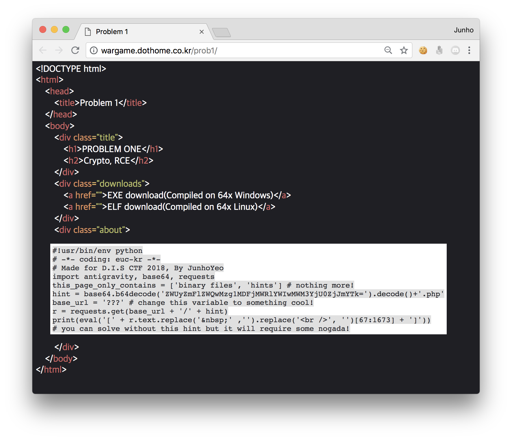

# Problems for DIS 2018


참고로 문제 제목은 제가 정한 게 아닙니다.

## Problem One (REVERGRAPHY, Spain)


[http://wargame.dothome.co.kr/prob1/](http://wargame.dothome.co.kr/prob1/)

주어진 링크에 접속하면 윈도우 및 리눅스 바이너리를 다운받을 수 있습니다.

```
prob1: ELF 64-bit LSB executable, x86-64, version 1 (SYSV), dynamically linked, interpreter /lib64/ld-linux-x86-64.so.2, for
 GNU/Linux 2.6.24, BuildID[sha1]=80f058d2a9e5433ee41ce5156bdfdd8b8d34c18e, not stripped
```

여기서는 리눅스 바이너리를 기준으로 문제풀이를 진행하도록 하겠습니다.


ida64를 사용해서 바이너리를 열고 Pseudocode를 생성하면 위와 같은 결과를 볼 수 있습니다. 여기서 우리는 다음과 같은 사실들을 알 수 있죠:

- 바이너리는 사용자에게 플래그를 입력받습니다.

- 먼저 `strlen()`으로 `flag`의 길이를 비교하는 부분에서, 플래그의 길이가 11임을 알 수 있습니다.

- 플래그의 길이와 동일한 크기의 int형 배열 `v7`을 만들고 `3840 * ((index + 53710) ^ s[index])` 연산을 실행해서 그 값을 index에 맞게 집어넣습니다.

- 그 다음 `compare_fl4g()` 함수로 함수 내부에 저장된 배열과 `v7`을 비교해서 일치하는 경우에만 `GOOD!`을 출력합니다.

즉, `compare_fl4g()` 내부의 int형 배열이 바로 플래그를 위 알고리즘으로 암호화한 방식이라는 것이죠.

따라서 브루트포스를 하거나 역연산을 하면 별다른 어려움 없이 플래그를 구할 수 있을 것입니다.

```python
flag = [
    205977600, 205958400, 206012160, 
    206031360, 206104320, 206150400, 
    206150400, 206184960, 206142720, 
    206400000, 206088960
]
ans = ''
for index in range(11):
    for data in range(256):
        if (3840 * ((index + 53710) ^ (data))) == flag[index]:
            ans += chr(data)
print(ans) # FLAG{fake!}
```

저는 간단하게 위와 같은 스크립트를 작성해서 풀어보았습니다.

그 결과 얻은 값은 바로 `FLAG{fake!}`! 

그렇습니다. 사실 페이크였습니다.

이제 계속 ida로 다른 의심스러운 부분이 있는지 살펴봅시다. 


`need_hint()` 함수가 있네요. 커다란 int형 배열을 정수 형태로 출력하는 함수라는 것을 알 수 있습니다.


데이터 영역을 살펴보면 배열의 내용을 확인할 수 있는데, `#!usr/bin/env python`으로 시작하는 것을 보아 파이썬 스크립트가 있는 것 같습니다. 다만 이를 추출하는 것은 조금 노가다가 될 수 있는데요.

더 쉽게 해결하기 위해서 문제가 있었던 웹페이지로 다시 돌아가 봅시다.

```python
#!usr/bin/env python
# -*- coding: euc-kr -*-
# Made for D.I.S CTF 2018, By JunhoYeo
import antigravity, base64, requests
this_page_only_contains = ['binary files', 'hints'] # nothing more!
hint = base64.b64decode('ZWUyZmFlZWQwMzg1MDFjMWRlYWIwMWM3YjU0ZjJmYTk=').decode()+'.php'
base_url = '???' # change this variable to something cool!
r = requests.get(base_url + '/' + hint)
print(eval('[' + r.text.replace('&nbsp;' ,'').replace('<br />', '')[67:1673] + ']'))
# you can solve without this hint but it will require some nogada!
```

위와 같은 코드가 힌트로 주어졌습니다. 

`base_url`을 [http://wargame.dothome.co.kr/prob1](http://wargame.dothome.co.kr/prob1)로 바꾸고 실행하면 바로 그 리스트가 출력됩니다. ~~이 스크립트는 antigravity를 무료로 import해드립니다.~~

```python
[35, 33, 117, 115, 114, 47, 98, 105, 110, 47, 101, 110, 118, 32, 112, 121, 116, 104, 111, 110, 10, 35, 32, 45, 42, 45, 32, 99, 111, 100, 105, 110, 103, 58, 32, 101, 117, 99, 45, 107, 114, 32, 45, 42, 45, 10, 105, 109, 112, 111, 114, 116, 32, 104, 97, 115, 104, 108, 105, 98, 59, 32, 107, 101, 121, 32, 61, 32, 115, 117, 109, 40, 91, 111, 114, 100, 40, 99, 104, 97, 114, 41, 94, 105, 100, 120, 32, 102, 111, 114, 32, 105, 100, 120, 44, 32, 99, 104, 97, 114, 32, 105, 110, 32, 101, 110, 117, 109, 101, 114, 97, 116, 101, 40, 95, 95, 105, 109, 112, 111, 114, 116, 95, 95, 40, 39, 98, 97, 115, 101, 54, 52, 39, 41, 46, 98, 54, 52, 101, 110, 99, 111, 100, 101, 40, 98, 121, 116, 101, 115, 40, 105, 110, 112, 117, 116, 40, 41, 44, 32, 39, 85, 84, 70, 45, 56, 39, 41, 41, 46, 100, 101, 99, 111, 100, 101, 40, 41, 41, 93, 41, 59, 32, 102, 108, 97, 103, 32, 61, 32, 115, 116, 114, 40, 107, 101, 121, 32, 43, 32, 51, 57, 57, 57, 48, 53, 48, 53, 41, 10, 97, 100, 100, 114, 32, 61, 32, 40, 115, 116, 114, 40, 39, 48, 120, 37, 37, 48, 50, 88, 39, 37, 37, 40, 111, 114, 100, 40, 39, 92, 120, 48, 55, 39, 41, 41, 41, 32, 43, 32, 39, 98, 56, 99, 39, 46, 117, 112, 112, 101, 114, 40, 41, 32, 43, 32, 39, 101, 39, 32, 43, 32, 39, 103, 100, 98, 39, 91, 49, 58, 93, 32, 43, 32, 39, 69, 56, 65, 98, 56, 51, 70, 48, 54, 68, 70, 65, 100, 67, 39, 32, 43, 32, 102, 108, 97, 103, 32, 43, 32, 39, 65, 52, 53, 52, 52, 100, 69, 51, 65, 49, 39, 41, 59, 32, 102, 108, 97, 103, 32, 61, 32, 39, 115, 101, 110, 100, 77, 101, 95, 69, 84, 72, 95, 39, 32, 43, 32, 97, 100, 100, 114, 10, 105, 102, 32, 104, 97, 115, 104, 108, 105, 98, 46, 115, 104, 97, 53, 49, 50, 40, 115, 116, 114, 40, 107, 101, 121, 32, 94, 32, 49, 50, 51, 52, 53, 41, 46, 101, 110, 99, 111, 100, 101, 40, 41, 41, 46, 104, 101, 120, 100, 105, 103, 101, 115, 116, 40, 41, 32, 61, 61, 32, 49, 51, 54, 51, 54, 58, 32, 102, 108, 97, 103, 32, 61, 32, 39, 33, 33, 67, 79, 82, 82, 69, 67, 84, 33, 33, 39, 32, 43, 32, 102, 108, 97, 103, 10, 112, 114, 105, 110, 116, 40, 39, 70, 76, 65, 71, 123, 39, 32, 43, 32, 102, 108, 97, 103, 32, 43, 32, 39, 125, 39, 41]
```


조금 더 자세히 살펴보면 [http://wargame.dothome.co.kr/prob1/ee2faeed038501c1deab01c7b54f2fa9.php](http://wargame.dothome.co.kr/prob1/ee2faeed038501c1deab01c7b54f2fa9.php)에 `need_hint()`의 코드가 존재하고, 배열 부분만 리스트 형태로 만들어서 반환해 주는 스크립트임을 알 수 있습니다.

```python
data = [
    35, 33, 117, 115, 114, 47, 98, 105, 110, 47,
    101, 110, 118, 32, 112, 121, 116, 104, 111, 110,
    10, 35, 32, 45, 42, 45, 32, 99, 111, 100,
    105, 110, 103, 58, 32, 101, 117, 99, 45, 107,
    114, 32, 45, 42, 45, 10, 105, 109, 112, 111,
    114, 116, 32, 104, 97, 115, 104, 108, 105, 98,
    59, 32, 107, 101, 121, 32, 61, 32, 115, 117,
    109, 40, 91, 111, 114, 100, 40, 99, 104, 97,
    114, 41, 94, 105, 100, 120, 32, 102, 111, 114,
    32, 105, 100, 120, 44, 32, 99, 104, 97, 114,
    32, 105, 110, 32, 101, 110, 117, 109, 101, 114,
    97, 116, 101, 40, 95, 95, 105, 109, 112, 111,
    114, 116, 95, 95, 40, 39, 98, 97, 115, 101,
    54, 52, 39, 41, 46, 98, 54, 52, 101, 110,
    99, 111, 100, 101, 40, 98, 121, 116, 101, 115,
    40, 105, 110, 112, 117, 116, 40, 41, 44, 32,
    39, 85, 84, 70, 45, 56, 39, 41, 41, 46,
    100, 101, 99, 111, 100, 101, 40, 41, 41, 93,
    41, 59, 32, 102, 108, 97, 103, 32, 61, 32,
    115, 116, 114, 40, 107, 101, 121, 32, 43, 32,
    51, 57, 57, 57, 48, 53, 48, 53, 41, 10,
    97, 100, 100, 114, 32, 61, 32, 40, 115, 116,
    114, 40, 39, 48, 120, 37, 37, 48, 50, 88,
    39, 37, 37, 40, 111, 114, 100, 40, 39, 92,
    120, 48, 55, 39, 41, 41, 41, 32, 43, 32,
    39, 98, 56, 99, 39, 46, 117, 112, 112, 101,
    114, 40, 41, 32, 43, 32, 39, 101, 39, 32,
    43, 32, 39, 103, 100, 98, 39, 91, 49, 58,
    93, 32, 43, 32, 39, 69, 56, 65, 98, 56,
    51, 70, 48, 54, 68, 70, 65, 100, 67, 39,
    32, 43, 32, 102, 108, 97, 103, 32, 43, 32,
    39, 65, 52, 53, 52, 52, 100, 69, 51, 65,
    49, 39, 41, 59, 32, 102, 108, 97, 103, 32,
    61, 32, 39, 115, 101, 110, 100, 77, 101, 95,
    69, 84, 72, 95, 39, 32, 43, 32, 97, 100,
    100, 114, 10, 105, 102, 32, 104, 97, 115, 104,
    108, 105, 98, 46, 115, 104, 97, 53, 49, 50,
    40, 115, 116, 114, 40, 107, 101, 121, 32, 94,
    32, 49, 50, 51, 52, 53, 41, 46, 101, 110,
    99, 111, 100, 101, 40, 41, 41, 46, 104, 101,
    120, 100, 105, 103, 101, 115, 116, 40, 41, 32,
    61, 61, 32, 49, 51, 54, 51, 54, 58, 32,
    102, 108, 97, 103, 32, 61, 32, 39, 33, 33,
    67, 79, 82, 82, 69, 67, 84, 33, 33, 39,
    32, 43, 32, 102, 108, 97, 103, 10, 112, 114,
    105, 110, 116, 40, 39, 70, 76, 65, 71, 123,
    39, 32, 43, 32, 102, 108, 97, 103, 32, 43,
    32, 39, 125, 39, 41
]
script = ''
for char in data:
    script += chr(char)
print(script)
```

위처럼 int형 배열의 원소들을 모두 chr형으로 바꿔서 이으면 스크립트가 나타납니다.

```python
#!usr/bin/env python
# -*- coding: euc-kr -*-
import hashlib; key = sum([ord(char)^idx for idx, char in enumerate(__import__('base64').b64encode(bytes(input(), 'UTF-8')).decode())]); flag = str(key + 39990505)
addr = (str('0x%%02X'%%(ord('\x07'))) + 'b8c'.upper() + 'e' + 'gdb'[1:] + 'E8Ab83F06DFAdC' + flag + 'A4544dE3A1'); flag = 'sendMe_ETH_' + addr
if hashlib.sha512(str(key ^ 12345).encode()).hexdigest() == 13636: flag = '!!CORRECT!!' + flag
print('FLAG{' + flag + '}')
```

```
  File "exploit.py", line 59
    addr = (str('0x%%02X'%%(ord('\x07'))) + 'b8c'.upper() + 'e' + 'gdb'[1:] + 'E8Ab83F06DFAdC' + flag + 'A4544dE3A1'); flag= 'sendMe_ETH_' + addr
                          ^
SyntaxError: invalid syntax
```

헉 그런데 실행해보면 위와 같은 에러가 뜨네요. `%`를 `%%`로 잘못 입력했군요. 

```python
#!usr/bin/env python
# -*- coding: euc-kr -*-
import hashlib; key = sum([ord(char)^idx for idx, char in enumerate(__import__('base64').b64encode(bytes(input(), 'UTF-8')).decode())]); flag = str(key + 39990505)
addr = (str('0x%02X'%(ord('\x07'))) + 'b8c'.upper() + 'e' + 'gdb'[1:] + 'E8Ab83F06DFAdC' + flag + 'A4544dE3A1'); flag = 'sendMe_ETH_' + addr
if hashlib.sha512(str(key ^ 12345).encode()).hexdigest() == 13636: flag = '!!CORRECT!!' + flag
print('FLAG{' + flag + '}')
```

위처럼 간단하게 바꿔줍시다. ~~아 물론 이 실수는 의도한겁니다.~~

누가 봐도 Python3 syntax니 Python3으로 실행하면 `input()`에서 문자열 하나를 입력받으려고 하는데요. 

아무리 봐도 넣을 것이 `FLAG{fake!}`밖에 없습니다. 입력하면 진짜 플래그가 나옵니다.

`FLAG{sendMe_ETH_0x07B8CedbE8Ab83F06DFAdC39991910A4544dE3A1}`

와아아아! ><

여담으로 `hashlib.sha512(str(key ^ 12345).encode()).hexdigest()` 부분은 좀 더 복잡하게 만들려고 할려고 했다가 방치해버린 산물입니다. 

익스는 곧 추가해드릴게요 충성^^7

## Problem Two (Another WEb?, Burkina Faso)
PHP의 `get_defined_vars()`는 영역 안에 정의되는 모든 변수 목록의 리스트를 반환합니다.


[레퍼런스](http://php.net/manual/en/function.get-defined-vars.php) 만세!! 
[http://wargame.dothome.co.kr/prob2/index.php?c=print_r(get_defined_vars());]()

`FLAG{I_us3_k1ng_G0d_l4n9_PHP_so_$ME!=="AHSSA"?????}`

## Problem Sam (YEOEY, Kyrgyzstan)
대체 왜 이 문제 제목이 YEOEY으로 된 건지 모르겠습니다.


가면 바로 플래그를 준다고 합니다!


두둥 바로 헤더에 있어요 ><

데프콘 2018 예선문제에서 영감을 얻어서 애교로 만든 문제입니다.

`FLAG{S0E4SY,huh,,,i_am_so_kind_i_9uess}`
